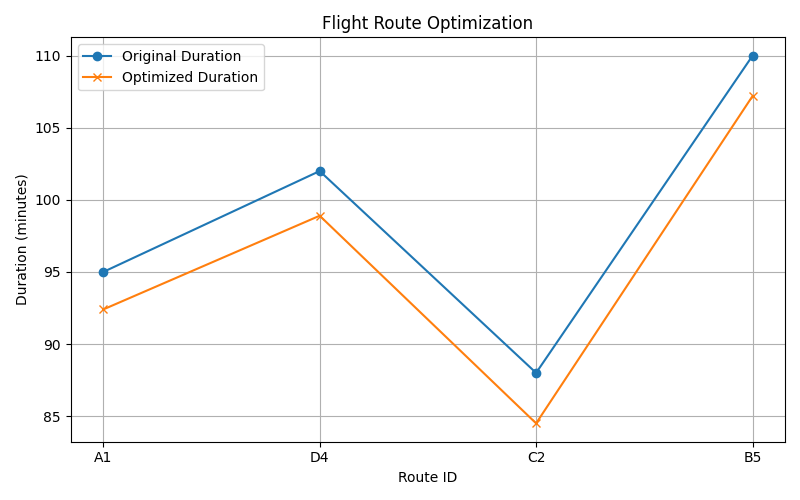

# Aeronautical Data Modeling & Strategic Optimization  
Course: USC Viterbi ITP 116

I am currently pursuing data optimization and predictive modeling in the context of aviation analytics. This project draws on satellite intelligence from Maxar and applies machine learning methods to enhance flight routing, procedural accuracy, and weather adaptability.

The focus is strategic. Algorithms are designed to reduce inefficiencies in air travel, improve decision support systems, and elevate aerospace performance metrics. Technologies used include Python, NumPy, Pandas, Scikit-learn, and geospatial datasets.

My objective is clear: to model real-world complexity in flight data and produce results that serve the next generation of aviation intelligence.

